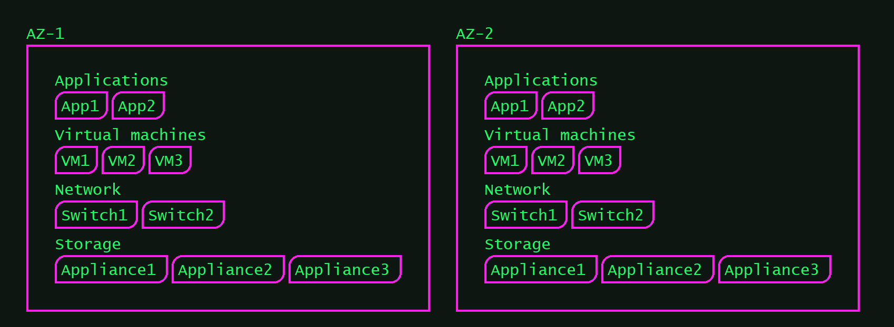
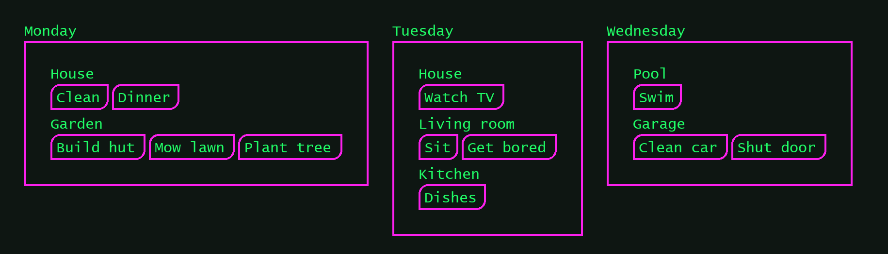
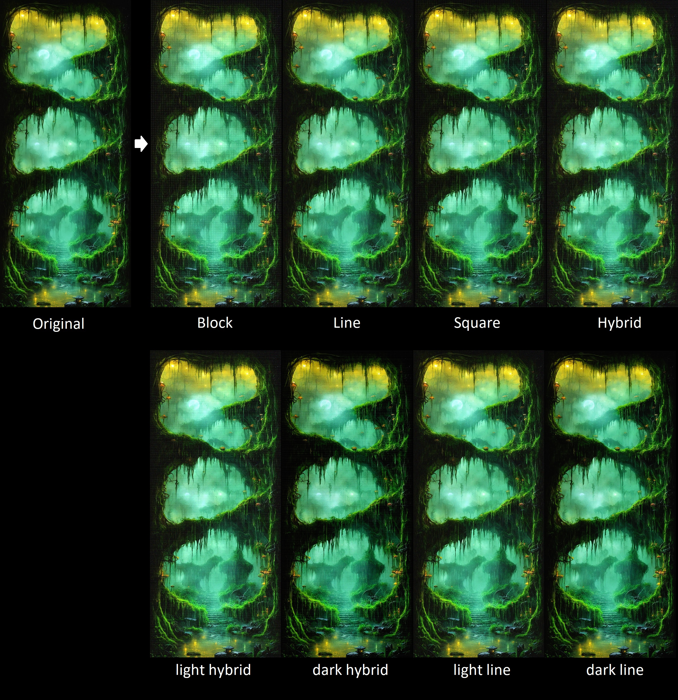

## Python scripts for various stuff

These scripts are not production grade and just helped me with some things I wanted to automate.

### [+] archdraw

This script draws a custom cluster view of configured values from your config file. Colors can be changed in the themes file.

Both files can be referenced with flags shown below.

Args:
- -config [string] --> path to config YAML file
- -theme [string] --> path to theme YAML file

Example:
- ./archdraw.py -config configs/cluster.yml -theme themes/default.yml

---

### [+] image pattern filter

This script applies a given filter to a single image or batch of images

Args:
- -target [string] --> path to image (if "all" is set all images in ./src_dir will be processed)
- -pattern [string] --> sets the pattern for the filter (square, line, block, hybrid)
- -scale [int] --> sets the scale of the patterns (max. is 10)
- -mode [string] --> sets the filter ("light" or "dark")

Example:
- ./pattern.py -pattern hybrid -target forest.jpg -scale 1 -mode light

---

### [+] colorpalette

This script takes a target picture and reads all colors within it to create a top-X list of identical colors used (left is most used, decreasing to the right).

The more CPUs you use, the faster it is:
- 2 CPUs --> 345 seconds (for the test picture)
- 10 CPUs --> 26 seconds (for the test picture)

Args:
- -top [int] --> -top 10 (shows top10 colors in the picture)
- -cpus [int] --> -cpus 4 (uses 4 CPUs to process the picture)
- -target [path/to/image] --> -target ./img.png (processes img.png)

Example:
- ./colorpalette.py -top 10 -cpus 10 -target ./test.png

---

### [+] digital-fragments

This script takes all pictures in "./src_images" and creates "fragments" and saves the result in "./dst_images".

There is a "sign-generator.py" script that simply writes all words that are listed (line-by-line) in "wordlist.txt" on PNGs and puts them also in "./src_images".

All "fragments" are unique and random so re-executing the script on the same picture always ends up slightly different.

---

### [+] gifcreator

Experimental script to create gifs from a picture batch. Since it is experimental, read the code (super simple) if you wanna use it.

---

### [+] image-slicer

Takes all pictures in "./raw_images" and slices them to the dimensions mentioned in the code (L12-17). The cropped images will be saved in "./sliced_images"

Maybe I should add CLI params but I was lazy.

---

### [+] image-stitcher

This creates a collage of pictures (all of the same size) from "./src_images" and saves the result in "./dst_images".

Since this was for Windows you have to rename the batch of your pictures in "./src_images" --> mark all images, hit "F2" and name them e.g. "test" and hit "ENTER".

---

### [+] imagegrabber

Highly experimental script that detects a picture pattern within a running application window (WIN only).

Use it only for reference.

---

### [+] pixelize

This script pixelizes all images in "./src_images" and saves the result in "./dst_images".

Args:
- -px [int] --> -px 4 (pixel mask is 4px)

---

### [+] prometheus_pretty

This script just reads from a prometheus URL (e.g. https://myapp:2222/metrics) and prettifies the output.

Since this is tailored to another project of me, this can be used for reference but is useless as-is.

---